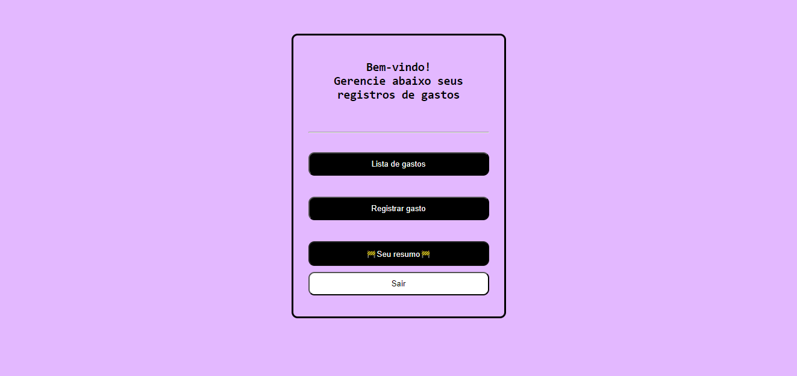
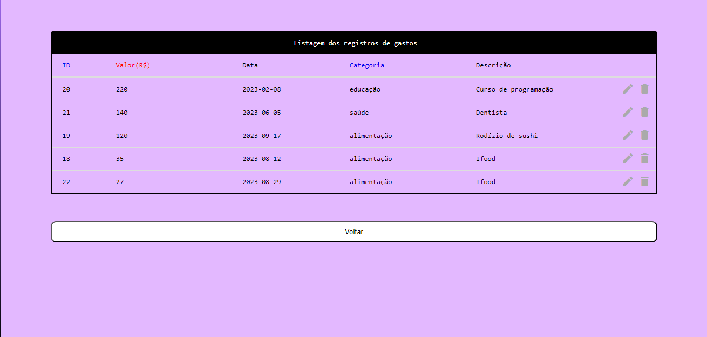
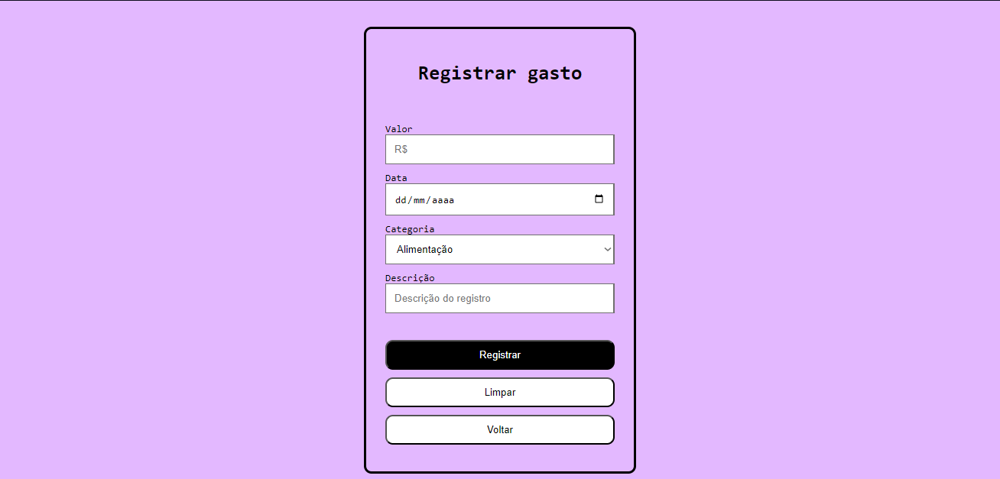

# Expense Managment App 💵

> 🏡 Repositório para uma aplicação web de gerenciamento de gastos

## Tecnologias utilizadas
* Java
* Spring Boot
* HTML
* CSS
* Javascript
* MySQL

## Imagens do projeto

### Login

### Home

### Registros

### Registrar gastos

## Autor
👤 **Pedro Henrique**
* Github: [@PedroHenriquebc](https://github.com/PedroHenriquebc)
* LinkedIn: [Pedro Henrique Barros da Costa](https://www.linkedin.com/in/pedro-henriquebc/)

## Mostre seu apoio

Dê uma ⭐️ se você gostou deste projeto!
